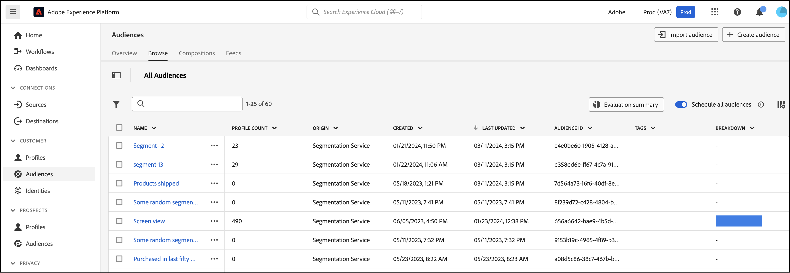
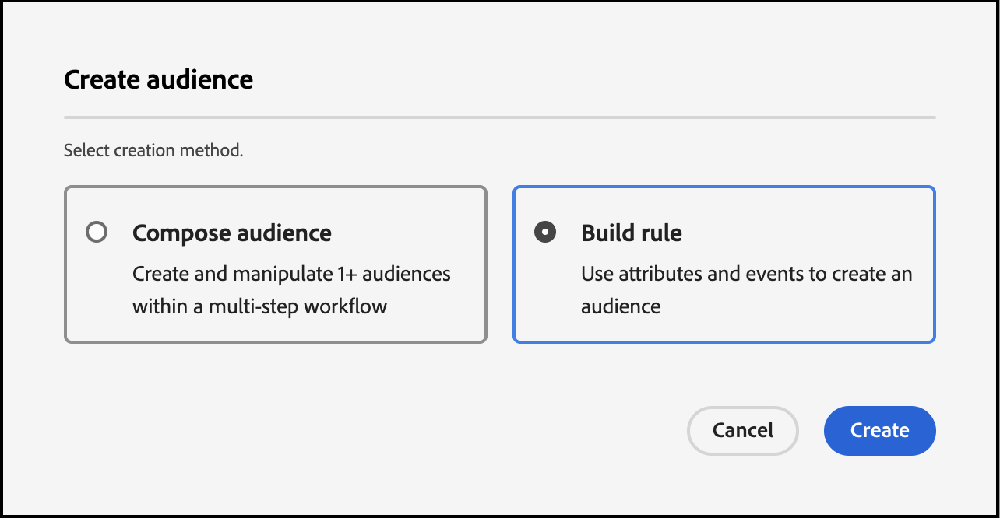
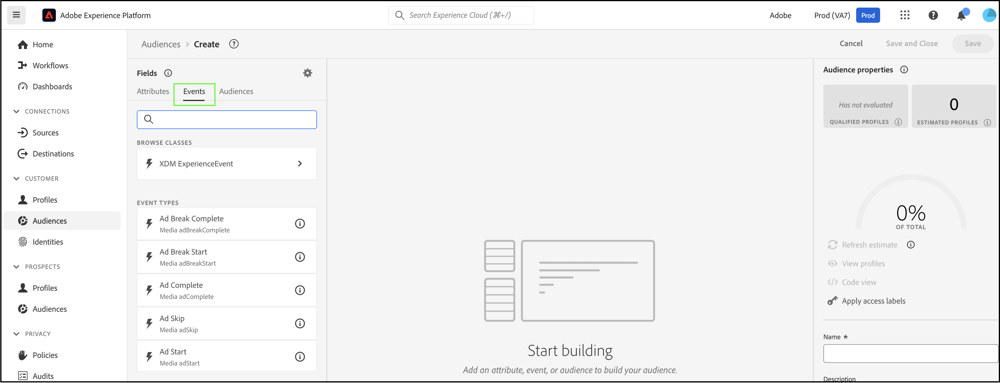
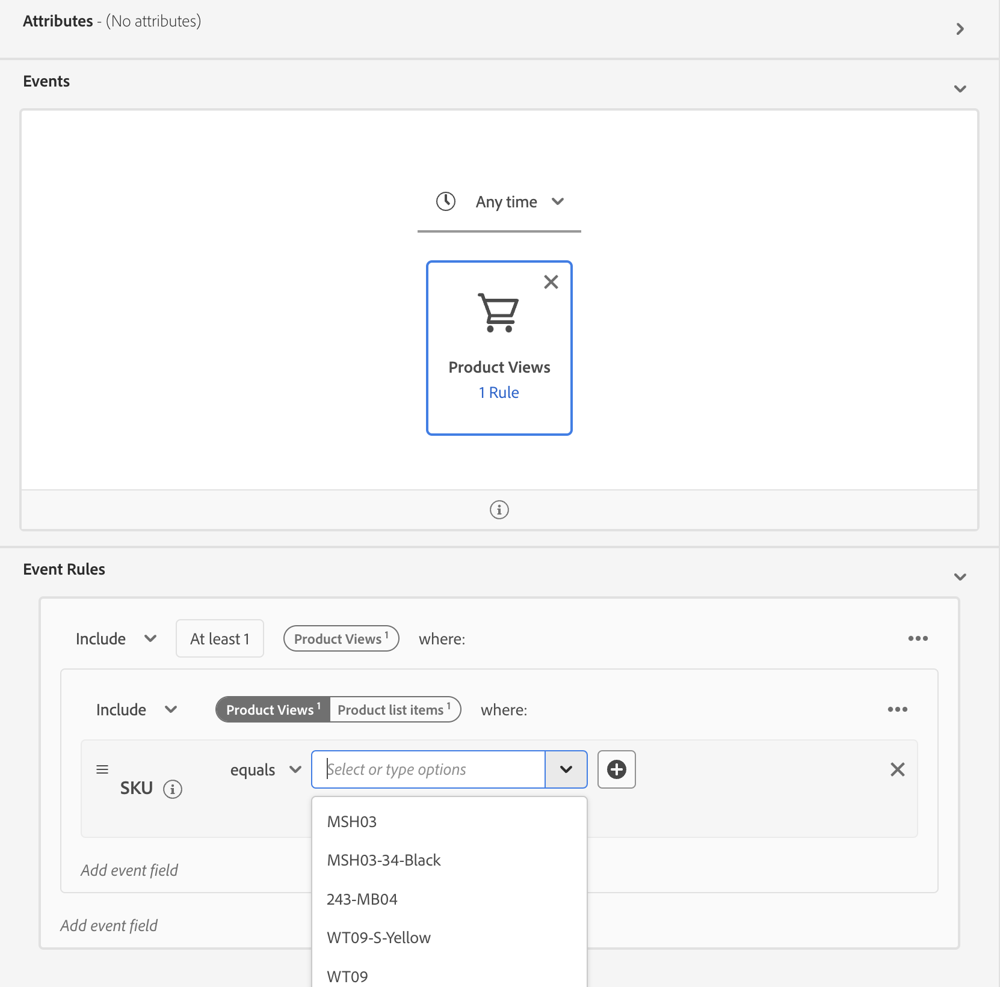

# Creare tipi di pubblico in Real-Time CDP tramite [!DNL Commerce] Dati evento

Utilizza i dati evento acquisiti dal tuo [!DNL Commerce] archiviare per creare tipi di pubblico in Real-Time CDP. I dati acquisiti si basano sul comportamento di navigazione, sugli acquisti precedenti, sugli attributi del profilo, sulle tendenze di conversione o abbandono, sullo stato di fedeltà, sul valore elevato e basso per il cliente e su altro ancora.

## Quali dati devo prendere in considerazione per l’utilizzo?

Crea tipi di pubblico in Real-Time CDP utilizzando dati provenienti da eventi di vetrina, back office e profilo.

| Tipi di dati | Dati storefront (eventi comportamentali) | Dati di back office (eventi lato server) | Profilo cliente e dati dei segmenti |
|---|---|---|---|
| **Definizione** | Clic o azioni eseguite dai clienti sul sito. | Informazioni sul ciclo di vita e dettagli di ciascun ordine (passato e corrente). | Chi sono i tuoi acquirenti e a quali segmenti si qualificano. |
| **Eventi acquisiti da Adobe Commerce** | [productPageView](events.md#productpageview) [addToCart](events.md#addtocart) | [placeOrder](events.md#completecheckout) [ordinato](events-backoffice.md#orderplaced) [orderLineItemRereturned](events-backoffice.md#orderlineitemrefunded) [ordine annullato](events-backoffice.md#ordercancelled) [cronologia ordini](connect-data.md#send-historical-order-data) | [createAccount](events.md#createaccount) [editAccount](events.md#editaccount) [Record profilo](events-profilerecord.md) |

## Quali sono stati i risultati ottenuti dagli altri clienti?

Adobe [!DNL Commerce] i clienti hanno ottenuto un impatto significativo sulle attività grazie all’attivazione dei tipi di pubblico incorporati in Real-Time CDP e alla loro distribuzione nei [!DNL Commerce] dell&#39;istanza.

Un rivenditore di abbigliamento globale e multimarca ha raggiunto:

- Una fonte di verità con 10 milioni di profili cliente unificati
- Oltre 40 tipi di pubblico univoci di &quot;clienti ad alto intento&quot; creati per interagire con i diversi canali

Una società di bevande globale ha raccolto:

- 98 milioni di profili cliente da oltre 100 paesi

## Iniziamo

In questo articolo imparerai a:

- Creare un pubblico in Real-Time CDP in base al [!DNL Commerce] dati raccolti dagli eventi
- Attiva il pubblico per il tuo [!DNL Commerce] archiviare
- Utilizzare il pubblico in [!DNL Commerce] per informare una regola prezzo carrello

>[!IMPORTANT]
>
>Completa le attività descritte in questo articolo utilizzando [!DNL Commerce] ambiente sandbox. In questo modo, i dati dell’evento di vetrina e di back office inviati ad Experienci Platform non diluiscono i dati dell’evento di produzione.

### Prerequisiti

Prima di iniziare, assicurati:

- È stato eseguito il provisioning per utilizzare Real-Time CDP. In caso di dubbi, rivolgiti all’integratore di sistemi o al team di sviluppo che gestisce progetti e ambienti.
- Tu [installato](install.md) e [configurato](connect-data.md) il [!DNL Data Connection] estensione in [!DNL Commerce].
- Tu [confermato](connect-data.md#confirm-that-event-data-is-collected) che il tuo [!DNL Commerce] i dati dell’evento stanno arrivando al server edge di Experienci Platform.

### 1. Creare un pubblico

Un pubblico è un insieme di clienti che condividono comportamenti o caratteristiche simili. In questo esercizio creerai un pubblico che qualifichi le persone interessate a un particolare prodotto del tuo negozio.

Per semplificare questo esercizio, puoi utilizzare i dati evento del [productPageView](events.md#productpageview) evento. Questo evento acquisisce i dettagli del prodotto visualizzato, ad esempio nome del prodotto, SKU, prezzo e così via.

Utilizza questi dati evento per specificare che il pubblico include persone che hanno almeno un evento &quot;Visualizzazioni prodotto&quot; in cui lo SKU (identificatore prodotto) è uguale a un prodotto specifico sul sito e l’evento si verifica nell’ultimo giorno. &#x200B;

1. Apri Experience Platform e seleziona **[!UICONTROL Audiences]** dal menu di navigazione sinistro.

   

1. Clic **[!UICONTROL Create Audience]**.

   

   Il **Generatore di segmenti** viene visualizzata l’area di lavoro.

1. In **Generatore di segmenti** Workspace, seleziona la **Genera regola** metodo di creazione.

   

   Il **Generatore di segmenti** workspace è il luogo in cui puoi definire le regole e le condizioni per il pubblico&#x200B; Queste regole e condizioni si basano sui dati di eventi e profili provenienti dal tuo archivio Commerce e definiscono i criteri che determinano se un utente è idoneo per il pubblico. Ad esempio, puoi creare una regola che includa gli utenti che hanno visualizzato un prodotto specifico o quelli che hanno effettuato un acquisto entro un determinato intervallo di tempo. Ulteriori informazioni su [Generatore di segmenti](https://experienceleague.adobe.com/en/docs/experience-platform/segmentation/ui/segment-builder) e le regole e condizioni.

1. Seleziona la [Eventi](https://experienceleague.adobe.com/en/docs/experience-platform/segmentation/ui/segment-builder#events) scheda.

   

1. Cerca il tipo di evento &quot;Visualizzazioni prodotto&quot;. Quindi, trascinalo nella **Generatore di segmenti** Workspace.

1. Torna a **Eventi** e cerca &quot;SKU&quot;, che è il campo dati sotto il `productListItems` campo. Trascina e rilascia fino a **Generatore di segmenti** area di lavoro sopra **Visualizzazione prodotto** evento.

   Il **Regole evento** Questa sezione mostra dove puoi specificare il prodotto specifico da cui desideri creare il pubblico.

   

1. Impostare l&#39;intervallo di tempo su un giorno facendo clic su **In qualsiasi momento** e selezione *Nell’ultimo/a* con un valore di *1*.

   Durante la creazione di un pubblico, puoi specificare un intervallo di tempo per acquisire le attività recenti. Impostando un intervallo di tempo puoi indirizzare l’attività agli utenti in base alle loro interazioni o comportamenti recenti entro un arco temporale specifico.

1. In **Proprietà pubblico** sul lato destro dell’area di lavoro, imposta le proprietà del pubblico fornendo un nome, una descrizione e un metodo di valutazione per il pubblico.

1. Per salvare il pubblico, fai clic su **[!UICONTROL Save and Close]**.

   I dettagli del pubblico vengono visualizzati sul **Pubblico** dashboard.

### 2. Attiva il pubblico in [!DNL Commerce] destinazione

Rendere disponibile un pubblico in [!DNL Commerce] attivandolo per [!DNL Commerce] destinazione.

>[!IMPORTANT]
>
>Se non hai già impostato [!DNL Commerce] come destinazione disponibile per la ricezione dei dati, vedi [Adobe [!DNL Commerce] Connessione](https://experienceleague.adobe.com/en/docs/experience-platform/destinations/catalog/personalization/adobe-commerce) argomento.

1. In **Dettagli** , fai clic su **Attiva nella destinazione**.

1. Seleziona il [!DNL Commerce] destinazione. Quindi, fai clic su **Successivo**.

1. Completare il processo di attivazione facendo clic su **[!UICONTROL Finish]**.

## 3. Visualizzare il pubblico nel dashboard Pubblico

In entrata [!DNL Commerce], puoi visualizzare tutto [attivo](https://experienceleague.adobe.com/en/docs/experience-platform/destinations/ui/activate/activate-edge-personalization-destinations) tipi di pubblico che possono essere personalizzati per [!DNL Commerce] istanza che utilizza **Pubblico Real-Time CDP** dashboard.

Per accedere al **Pubblico Real-Time CDP** dashboard, vai al _Amministratore_ barra laterale, quindi vai a **[!UICONTROL Customers]** > **[!UICONTROL Real-time CDP Audience]**.

Nel dashboard, cerca il pubblico creato. Nota che non viene utilizzato in una regola del prezzo del carrello o in un blocco dinamico. Nella sezione successiva, colleghi il pubblico a una regola del prezzo del carrello.

### 4. Crea una regola di prezzo del carrello in base al pubblico

Questa sezione mostra come creare una regola di prezzo del carrello in base al nuovo pubblico.

1. Conferma che il nuovo pubblico venga visualizzato in **Pubblico Real-Time CDP** dashboard.
1. [Creare una regola di prezzo del carrello](https://experienceleague.adobe.com/en/docs/commerce-admin/marketing/promotions/cart-rules/price-rules-cart-create).
1. [Imposta la condizione](https://experienceleague.adobe.com/en/docs/commerce-admin/marketing/promotions/cart-rules/price-rules-cart-create#use-real-time-cdp-audiences-to-set-a-condition) della regola del prezzo del carrello utilizzando il nuovo pubblico.
1. [Impostare l’azione](https://experienceleague.adobe.com/en/docs/commerce-admin/marketing/promotions/cart-rules/price-rules-cart-create#step-3-define-the-actions) che desideri verificare quando il prodotto viene aggiunto al carrello.
1. Continua a configurare la regola prezzo carrello.
1. Vai alla visualizzazione del cliente dell’istanza sandbox.
1. Aggiungi al carrello il prodotto di cui hai basato il pubblico. Tieni presente che la regola del prezzo del carrello è abilitata.

## A capo

In questo esercizio, hai creato un pubblico in Real-Time CDP e lo hai attivato nel [!DNL Commerce] destinazione. Quindi, nella [!DNL Commerce] amministratore, hai creato una regola di prezzo del carrello basata su quel pubblico e hai abilitato la regola nel tuo ambiente sandbox.
