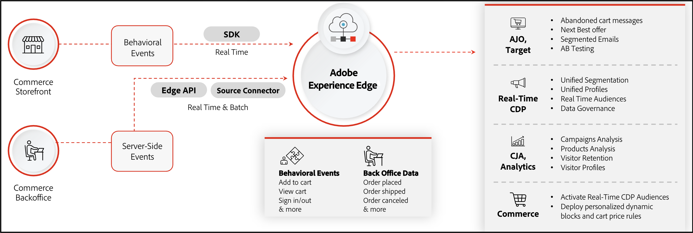

# [!DNL Data Connection] Introduzione

>[!IMPORTANT]
>
>Il connettore di Experience Platform è stato rinominato in [!DNL Data Connection].

Il [!DNL Data Connection] collega la tua istanza web di Adobe Commerce a Adobe Experience Platform e Edge Network. Scopri come [integrare](./mobile-sdk-epc.md) Adobe Experience Platform Mobile SDK con Commerce.

Il tuo archivio Commerce contiene molti dati. Le informazioni su come gli acquirenti navigano, visualizzano e infine acquistano i prodotti sul sito possono rivelare opportunità per creare un’esperienza di acquisto più personalizzata. Anche se tali dati possono informare le funzioni native di Commerce, come le regole di prezzo del carrello e i blocchi dinamici, i dati rimangono in silos nell’istanza Commerce.

Adobe Experience Platform offre una suite di tecnologie che, se utilizzate con i dati provenienti dal tuo punto vendita Commerce, possono distribuire tali dati tramite la rete Edge ad altri prodotti Adobe DX per acquisire informazioni approfondite sul comportamento d’acquisto dei tuoi acquirenti. Con queste informazioni approfondite, puoi creare un’esperienza di acquisto più personalizzata su tutti i canali.

L’immagine seguente mostra il flusso di dati Commerce dal tuo store ad altri prodotti DX di Adobe:

Nell’immagine precedente, i dati comportamentali, di back office e del profilo cliente vengono inviati al server Edge di Experienci Platform utilizzando un SDK, un’API e un connettore di origine. Non è necessario comprendere appieno il funzionamento di tali parti, in quanto l’estensione gestisce automaticamente la complessità della condivisione dei dati. Quando i dati dell’evento si trovano al limite, puoi richiamarli in altre applicazioni Experienci Platform. Ad esempio:

| Applicazione | Finalità | Casi d’uso |
|---|---|---|
| [Adobe [!DNL Real-Time CDP]](https://experienceleague.adobe.com/docs/experience-platform/rtcdp/intro/rtcdp-intro/overview.html?lang=it) | Servizio di gestione dei profili e segmentazione | **Segmentazione cronologia acquisti**: gli esercenti possono identificare i clienti che acquistano un articolo in base a un periodo di tempo specifico (mensile, trimestrale, annuale e così via). I commercianti possono quindi creare segmenti per questi clienti e destinarli a promozioni, campagne e come _parte superiore del funnel_ dati per i lead per i servizi di abbonamento.  **Segmentazione basata su categorie**: i commercianti possono vedere quale categoria di prodotti è stata acquistata.  **Segmentazione basata sull’offerta**: i commercianti possono identificare i clienti che restituiscono costantemente i prodotti. Le offerte e gli sconti concessi possono ora essere più intelligenti. Ad esempio, la spedizione gratuita può essere rimossa per un cliente che restituisce prodotti in qualsiasi momento.  **Targeting per similarità**: A _Pubblico simile_ è una metodologia adottata da un commerciante per le sue promozioni per raggiungere nuove persone che probabilmente saranno interessate alla sua attività perché condividono caratteristiche simili ai vostri clienti esistenti. I segmenti simili possono essere creati in base a dati comportamentali e transazionali.  **Propensione del cliente**: i cambiamenti nel comportamento del cliente possono essere identificati come risultato dei profili cliente più profondi che possono essere creati dai dati transazionali. L’affidabilità del punteggio di propensione sarà maggiore in quanto nei calcoli fluiranno più dati, ad esempio resi dei prodotti e configurazioni dei prodotti.  **Cross-selling**: un commerciante può identificare forti opportunità di cross-selling e up-sell dalle informazioni granulari acquisite in Commerce. |
| [Cliente [!DNL Journey Analytics]](https://experienceleague.adobe.com/docs/analytics-platform/using/cja-overview/cja-overview.html) | Analisi approfondita dell’intero percorso Commerce | **Tendenze stagionali**: un commerciante può identificare le tendenze stagionali, che li aiutano a prepararsi al cambiamento periodico della domanda di determinati prodotti. Inoltre, i commercianti possono identificare i cambiamenti nella popolarità complessiva di qualsiasi prodotto attraverso gli anni.  **Analisi della conversione**: sapendo quando un prodotto è stato acquistato, insieme all’accesso agli eventi di impression della vetrina, i commercianti possono generare un profilo avanzato del cliente per eseguire l’analisi della conversione. |
| [Adobe [!DNL Analytics]](https://experienceleague.adobe.com/docs/analytics/analyze/admin-overview/analytics-overview.html) | Analisi approfondita del comportamento dei clienti e delle prestazioni della campagna | **Restituzioni ordine**: i commercianti possono identificare i clienti e i segmenti di clienti più ampi che hanno un modello di prodotti di ritorno. Questo aiuta i commercianti a migliorare la loro strategia di e-commerce mentre capiscono come si presenta il loro comportamento di base del cliente.  **Indirizzo ordine**: in base all’indirizzo di spedizione, un commerciante può capire se gli ordini vengono inoltrati dai clienti stessi o se sono per un’altra persona fisica o giuridica.  **Tendenze stagionali**: un commerciante può identificare le tendenze stagionali, che li aiutano a prepararsi al cambiamento periodico della domanda di determinati prodotti. Inoltre, i commercianti possono identificare i cambiamenti nella popolarità complessiva di qualsiasi prodotto attraverso gli anni.  **Analisi della conversione**: sapendo quando un prodotto è stato acquistato, insieme all’accesso agli eventi di impression della vetrina, i commercianti possono generare un profilo avanzato del cliente per eseguire l’analisi della conversione. **Nota** Adobe Analytics supporta solo i dati evento comportamentali (vetrina). Adobe Analytics non supporta i dati evento transazionali (di backoffice). |
| [Adobe [!DNL Journey Optimizer]](https://experienceleague.adobe.com/docs/journey-optimizer/using/get-started/get-started.html) | Orchestrazione di campagne tra canali diversi | **Percorsi basati sul comportamento**: i commercianti possono rivolgersi a un cliente che ha acquistato un telefono cellulare due anni fa suggerendogli di acquistare il nuovo modello. I commercianti possono creare campagne e promozioni personalizzate per questi clienti e utilizzare le funzionalità e-mail e SMS per contattarli. Inoltre, i commercianti possono utilizzare l’ordine storico e i dati comportamentali per identificare le tendenze. Ad esempio, un cliente che ha acquistato un articolo con una particolare configurazione in passato e ora sta cercando di acquistare nuovamente lo stesso prodotto, può migliorare il proprio percorso di acquisto fornendo visibilità e accesso alle stesse configurazioni di prodotto.  **Personalizzazione**: con accesso alle informazioni del profilo cliente, [!DNL Journey Optimizer] può sbloccare percorsi altamente personalizzati che consentono ai commercianti di raggiungere i clienti su più canali diversi.  **Nuovo profilo creato**: le e-mail di benvenuto e le attività promozionali possono incoraggiare e influenzare i nuovi clienti nei loro percorsi.  **Profilo eliminato**: i commercianti possono scegliere di interrompere l’invio di e-mail promozionali ai clienti che hanno chiuso il loro account. In alternativa, i commercianti possono anche creare campagne per recuperare i clienti persi. |

## Estrarre dati di Experience Platform in Commerce

Invio dei dati di Commerce all’Experience Platform tramite [!DNL Data Connection] l’estensione è un lato delle funzionalità di condivisione dati di Commerce. L’altro lato, che è un’estensione facoltativa, è denominato [Audience Activation](https://experienceleague.adobe.com/docs/commerce-admin/customers/audience-activation.html). Questa estensione consente di creare tipi di pubblico in Real-Time CDP e distribuirli nel tuo archivio Commerce per informarti sulle regole di prezzo del carrello, sulle regole di prodotto correlate e sui blocchi dinamici.

Ad alto livello, il flusso di dati dall’archivio Commerce all’Experience Platform e viceversa attraverso l’estensione Audience Activation si presenta come segue:

![[!DNL Data Connection] flusso](assets/data-connection.png)

Dopo aver impostato la connessione tra Commerce e l’Experience Platform e l’Experience Platform in Commerce, il flusso dei dati continua. Non è necessario riconnettersi, a meno che non sia richiesto da un aggiornamento.

## Concetti

La condivisione di dati tra questi due sistemi richiede la comprensione di diversi concetti.

* **Dati** : i dati che vengono condivisi con l’Experience Platform sono i dati raccolti dagli eventi del browser nella vetrina, dagli eventi di back office sul server e dai dati dei record del profilo. Gli eventi di vetrina vengono acquisiti dalle interazioni degli acquirenti sul sito e includono eventi come [`addToCart`](events.md#addtocart), [`pageView`](events.md#pageview), [`createAccount`](events.md#createaccount), [`editAccount`](events.md#editaccount), [`startCheckout`](events.md#startcheckout), [`completeCheckout`](events.md#completecheckout), [`signIn`](events.md#signin), [`signOut`](events.md#signout)e così via. Consulta [eventi vetrina](events.md#storefront-events) per l’elenco completo degli eventi storefront. Gli eventi lato server o back office includono [stato ordine](events-backoffice.md#order-status) informazioni quali [`orderPlaced`](events-backoffice.md#orderplaced), [`orderReturned`](events-backoffice.md#orderitemreturncompleted), [`orderShipped`](events-backoffice.md#ordershipmentcompleted), [`orderCancelled`](events-backoffice.md#ordercancelled)e così via. Consulta [eventi di back office](events-backoffice.md) per l&#39;elenco completo degli eventi di back office. I dati dei record profilo contengono informazioni relative alla creazione, all’aggiornamento o all’eliminazione di un nuovo profilo. Consulta [dati record profilo](events-profilerecord.md) per ulteriori informazioni.

* **Experience Platform e rete Edge** : data warehouse per la maggior parte dei prodotti Adobe DX. I dati inviati all’Experience Platform vengono quindi propagati ai prodotti Adobe DX tramite la rete Edge di Experienci Platform. Ad esempio, puoi avviare Journey Optimizer, recuperare i dati di un evento Commerce specifico dal server Edge di e creare un’e-mail del carrello abbandonato in Journey Optimizer. Journey Optimizer può quindi inviare tale e-mail se nel tuo negozio Commerce sono presenti carrelli abbandonati. Ulteriori informazioni su [Experience Platform e rete Edge](https://experienceleague.adobe.com/docs/platform-learn/data-collection/web-sdk/overview.html).

* **Schema** : lo schema è ciò che descrive la struttura dei dati che viene inviato. Prima che Experienci Platform possa acquisire i dati di Commerce, devi comporre uno schema per descrivere la struttura dei dati e fornire vincoli al tipo di dati che possono essere contenuti all’interno di ciascun campo. Gli schemi sono costituiti da una classe base e da zero o più gruppi di campi schema. Lo schema utilizza la struttura XDM, che può essere letta da tutti i prodotti Adobe DX. Pertanto, quando invii i dati all’Experience Platform, puoi essere sicuro che i tuoi dati siano compresi in tutti i prodotti DX. Ulteriori informazioni su [schemi](https://experienceleague.adobe.com/docs/experience-platform/xdm/home.html).

* **Set di dati** : costrutto di archiviazione e gestione per una raccolta di dati, in genere una tabella che contiene uno schema (colonne) e campi (righe). I set di dati contengono anche metadati che descrivono vari aspetti dei dati memorizzati. Tutti i dati acquisiti correttamente in Adobe Experience Platform sono contenuti all’interno dei set di dati. Ulteriori informazioni su [set di dati](https://experienceleague.adobe.com/docs/experience-platform/catalog/datasets/overview.html).

* **Datastream** - ID che consente il flusso dei dati da Adobe Experience Platform ad altri prodotti Adobe DX. Questo ID deve essere associato a un sito web specifico all’interno della tua istanza Adobe Commerce specifica. Quando crei questo flusso di dati, specifica lo schema XDM creato in precedenza. Ulteriori informazioni su [flussi di dati](https://experienceleague.adobe.com/docs/experience-platform/datastreams/overview.html).

## Architettura supportata

Il [!DNL Data Connection] L&#39;estensione è disponibile sulle seguenti architetture:

* PHP/Luma
* [PWA Studi](https://developer.adobe.com/commerce/pwa-studio/integrations/adobe-commerce/aep/)
* [AEM](https://experienceleague.adobe.com/docs/experience-manager-cloud-service/content/content-and-commerce/integrations/aep.html)

## Prerequisiti

Per utilizzare [!DNL Data Connection] deve disporre dei seguenti elementi:

* Adobe Commerce 2.4.4 o versione successiva
* Adobe ID e ID organizzazione
* [Adobe Client Data Layer (ACDL)](https://experienceleague.adobe.com/docs/experience-platform/tags/extensions/client/client-data-layer/overview.html), necessario per raccogliere i dati dell’evento storefront
* Diritti ad altri prodotti Adobe DX.

## Passaggi di onboarding

Ad alto livello, consentendo la [!DNL Data Connection] l&#39;estensione prevede i seguenti passaggi:

1. [Installa](install.md) il [!DNL Data Connection] estensione.
1. [Accedi](https://helpx.adobe.com/manage-account/using/access-adobe-id-account.html) al tuo account Adobe e [visualizza per confermare](https://experienceleague.adobe.com/docs/core-services/interface/administration/organizations.html#concept_EA8AEE5B02CF46ACBDAD6A8508646255) il tuo ID organizzazione. L’ID organizzazione è l’ID associato alla società di Experience Cloud con provisioning. Questo ID è una stringa alfanumerica composta da 24 caratteri, seguita da (deve includere) `@AdobeOrg`.
1. Assicurati di avere [autorizzazione per la raccolta dati in Experienci Platform](https://experienceleague.adobe.com/docs/experience-platform/collection/permissions.html).
1. Rivedi [tipi di dati](data-ingestion.md) puoi raccogliere e inviare.
1. Crea o aggiorna [schema evento serie temporali](update-xdm.md) o [schema dati record profilo](profile-data.md) con gruppi di campi specifici di Commerce.
1. [Creare un set di dati](https://experienceleague.adobe.com/docs/platform-learn/implement-mobile-sdk/experience-cloud/platform.html#create-a-dataset) in base allo schema creato o aggiornato. Questo set di dati contiene i dati Commerce inviati a Experienci Platform Edge.
1. [Creare un flusso di dati](https://experienceleague.adobe.com/docs/experience-platform/datastreams/overview.html) e seleziona lo schema XDM che contiene i gruppi di campi specifici di Commerce.
1. [Connetti a Commerce Services](../landing/saas.md).
1. [Connetti a Adobe Experience Platform](connect-data.md).

Il resto di questa guida illustra in modo più dettagliato tutti questi passaggi, consentendoti di imparare a usare al meglio e iniziare a utilizzare la potenza dei prodotti Adobe DX nel tuo punto vendita Commerce.

>[!NOTE]
>
>Per gli sviluppatori mobili, scopri come [integrare](./mobile-sdk-epc.md) Adobe Experience Platform Mobile SDK con Commerce.

## Pubblico

Questa guida è progettata per il commerciante di Adobe Commerce che desidera arricchire e personalizzare il proprio negozio Commerce per migliorare l’esperienza di acquisto dei propri clienti.

## Supporto

Se hai bisogno di informazioni o hai domande che non sono trattate in questa guida, utilizza le risorse seguenti:

* [Centro assistenza](https://experienceleague.adobe.com/docs/commerce-knowledge-base/kb/overview.html){target="_blank"}
* [Ticket di supporto](https://experienceleague.adobe.com/docs/commerce-knowledge-base/kb/help-center-guide/magento-help-center-user-guide.html#submit-ticket){target="_blank"}- Inviate un ticket per ricevere ulteriore aiuto.
