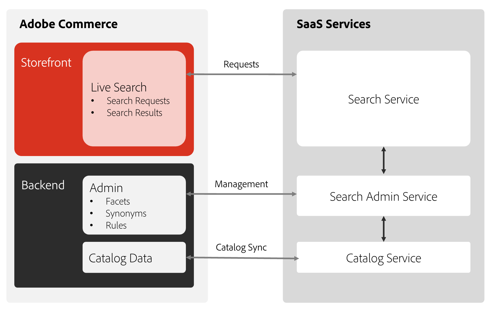

# Cos’è [!DNL Live Search]?

[!DNL Live Search] è un’estensione che sostituisce le funzionalità di ricerca standard di Adobe Commerce. Il [!DNL Live Search] L&#39;estensione viene installata con Composer e collega [!DNL Commerce] installazione in [!DNL Live Search] [servizio](../landing/saas.md). Una volta configurato, il campo di testo di ricerca predefinito viene sostituito con [!DNL Live Search] campo di testo. [!DNL Live Search] installa anche il widget Pagina di elenco prodotti (PLP), che fornisce solide funzionalità di filtro durante la navigazione nei risultati di ricerca.

Con [!DNL Live Search], è possibile:

- Crea esperienze di ricerca significative per aiutare acquirenti e acquirenti a trovare ciò che desiderano con il minimo sforzo possibile.
- Sfrutta il faceting dinamico basato sull’intelligenza artificiale e la riclassificazione dei risultati di ricerca in risposta ai comportamenti degli acquirenti durante la sessione.
- Utilizza un servizio leggero basato su SaaS che offre aggiornamenti semplici ed è incluso nella licenza, riducendo il costo totale di proprietà.
- Ottieni informazioni tecniche abilitando API graphQL, flessibilità headless, ambienti sandbox API e SaaS ultra veloci.

>[!IMPORTANT]
>
>Adobe Commerce offre diverse opzioni per la ricerca del sito. Assicurati di leggere [Limiti e limiti](boundaries-limits.md) prima dell&#39;implementazione, per garantire [!DNL Live Search] si adatta alle esigenze aziendali.

## Architettura

Il lato Adobe Commerce dell’architettura include l’hosting della ricerca *Amministratore*, la sincronizzazione dei dati del catalogo e l&#39;esecuzione del servizio query. Dopo [!DNL Live Search] è installato e configurato, Adobe Commerce inizia a condividere i dati di ricerca e catalogo con i servizi SaaS. A questo punto, gli utenti amministratori possono impostare, personalizzare e gestire la ricerca [facet](facets.md), [sinonimi](synonyms.md), e [regole di merchandising](category-merch.md).

## Presentazione rapida

Con particolare attenzione a velocità, pertinenza e facilità d&#39;uso, [!DNL Live Search] è un cambiavalute sia per gli acquirenti che per i commercianti. Guarda il video seguente e segui una breve presentazione di [!DNL Live Search] dalla vetrina.

>[!VIDEO](https://video.tv.adobe.com/v/3418679?quality=12&learn=on)

Per un video più approfondito sull’utilizzo e la configurazione di Live Search, vedi [Dimostrazione completa su [!DNL Live Search]](https://experienceleague.adobe.com/docs/commerce-learn/tutorials/getting-started/capabilities/live-search-full-demonstration.html) argomento.

### Cerca durante la digitazione

[!DNL Live Search] risponde con i prodotti suggeriti e un&#39;immagine in miniatura dei risultati di ricerca principali in un [popover](storefront-popover.md) quando gli acquirenti digitano query in [Ricerca](https://experienceleague.adobe.com/docs/commerce-admin/catalog/catalog/search/search.html#quick-search) casella. Il [dettagli prodotto](https://experienceleague.adobe.com/docs/commerce-admin/start/storefront/storefront.html#product-page) Questa pagina viene visualizzata quando gli acquirenti fanno clic su un prodotto suggerito o in primo piano. A _Visualizza tutto_ nel piè di pagina del popover viene visualizzata la pagina dei risultati della ricerca.

[!DNL Live Search] restituisce i risultati di &quot;ricerca durante la digitazione&quot; per una query di due o più caratteri. Per una corrispondenza parziale, il numero massimo di caratteri per parola è 20. Il numero di caratteri nella query non è configurabile. Il popover include`name`, `sku`, e `category_ids` campi.

### Visualizza tutti i risultati di ricerca

Per elencare tutti i prodotti restituiti dalla query di ricerca durante la digitazione, fare clic su _Visualizza tutto_ nel piè di pagina della finestra a comparsa.

### Ricerca filtrata con facet

La ricerca filtrata utilizza più dimensioni di valori di attributo, oppure [facet](facets.md), come criterio di ricerca. La selezione dei filtri è definita dall’esercente e cambia in base ai prodotti restituiti, con i facet più comunemente utilizzati inseriti nella parte superiore dell’elenco.

Utilizza i facet come parametri URL:`http://yourwebsite.com?color=red`, e Live Search filtra i risultati in base a questi valori di attributo.

### Sinonimi

[Sinonimi](synonyms.md) espandi la portata e affina la messa a fuoco delle query includendo le parole che gli acquirenti potrebbero utilizzare diverse da quelle nel catalogo. Puoi regolare il dizionario dei sinonimi per mantenere gli acquirenti coinvolti e sulla strada per l&#39;acquisto.

### Regole di merchandising

Merchandising [regole](rules.md) forma l’esperienza di acquisto con istruzioni if-then che aggiungono logica ed eventi alla ricerca. Puoi facilmente aumentare o seppellire i prodotti per una promozione, una stagione o un altro periodo di tempo.

### Supporto termini di ricerca

[!DNL Live Search] supporta Commerce [reindirizzamenti termini di ricerca](https://experienceleague.adobe.com/docs/commerce-admin/catalog/catalog/search/search-terms.html). Ad esempio, gli utenti possono cercare un termine come &quot;Tariffe di spedizione&quot; ed essere portati direttamente alla pagina delle tariffe di spedizione.

## Componenti Live Search

- [!DNL Live Search] [widget popover](storefront-popover.md) è la casella che si apre sotto il campo di ricerca contenente i risultati della ricerca.
- [Widget pagina elenco prodotti](plp-styling.md) fornisce una pagina di elenco dei prodotti ricercabili con supporto per facet e sinonimi.
- [[!DNL Live Search] Amministratore](workspace.md) è dove vengono configurati regole, facet e sinonimi.

## [!DNL Live Search] workspace

Il [!DNL Live Search] [workspace](workspace.md) è l’area dell’Amministratore in cui configuri [!DNL Live Search] funzioni quali sinonimi, facet e merchandising di categorie.

## Eventi

[!DNL Live Search] utilizza [Eventi](events.md) per calcolare [Merchandising intelligente](category-merch.md) e [prestazioni](performance.md) dashboard. L’evento viene fornito con le implementazioni predefinite. L’evento per le vetrine headless deve essere abilitato manualmente.
