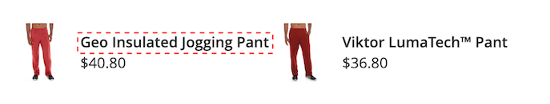

# [!DNL Storefront Popover]

Quando [!DNL Live Search] è [installato](install.md), a [!DNL popover] viene visualizzato nella vetrina quando gli acquirenti digitano nella [Ricerca](https://experienceleague.adobe.com/docs/commerce-admin/catalog/catalog/search/search.html#quick-search) casella. Con ogni carattere digitato, il [!DNL popover] viene aggiornato con i prodotti consigliati e le miniature dei risultati di ricerca principali.

[!DNL Live Search] restituisce risultati per una query di due o più caratteri. Per una corrispondenza parziale, il numero massimo di caratteri per parola è 20. Il numero di caratteri in una query di ricerca durante la digitazione non è configurabile.

Per impostazione predefinita, [!DNL Live Search] supporta [reindirizzamenti termini di ricerca](https://experienceleague.adobe.com/docs/commerce-admin/catalog/catalog/search/search-terms.html).

![[!DNL Live Search popover]](assets/storefront-search-as-you-type.png)

>[!TIP]
>
>Scopri come impostare gli attributi del prodotto come ricercabili in [Configurazione di Live Search](workspace.md) articolo.

## [!DNL Popover] dimensioni pagina

Dimensione della pagina del [!DNL popover] determina quante righe di prodotti completati automaticamente possono essere restituite. Durante l’installazione di Live Search, il `page_size` il valore cambia rispetto al valore corrente del [Ricerca nel catalogo](https://experienceleague.adobe.com/docs/commerce-admin/config/catalog/catalog.html) - `Autocomplete Limit` impostazione.

Per impostazione predefinita, il valore Ricerca nel catalogo - Limite completamento automatico è impostato su otto righe. Per modificare le dimensioni della pagina [!DNL popover], eseguire le operazioni seguenti:

1. Il giorno *Amministratore* barra laterale, vai a **Negozi** > Impostazioni > **Configurazione**.
1. Nel pannello a sinistra, espandi **Catalogo** e scegli **Catalogo** dall&#39;elenco delle impostazioni.
1. Espandi *Ricerca nel catalogo* sezione.
1. Imposta il **Limite completamento automatico** al numero di righe che si desidera consentire nel [!DNL popover].
1. Al termine, fai clic su **Salva configurazione**.

## Stile [!DNL Popover] esempio

È possibile personalizzare l&#39;aspetto del [!DNL Popover] widget per rispettare lo stile e le linee guida di branding della tua azienda.

Il [!DNL storefront popover] visualizza sempre il prodotto `name` e `price`e la selezione dei campi non è configurabile. Tuttavia, [!DNL popover] Gli elementi possono essere formattati utilizzando [CSS](https://developer.adobe.com/commerce/frontend-core/guide/css/) classi. Ad esempio, le seguenti dichiarazioni modificano il colore di sfondo del [!DNL popover] contenitore e piè di pagina.

```css
.livesearch.popover-container {
    background-color: lavender;
}

.livesearch.view-all-footer {
    background-color: magenta;
}
```

## Visibilità contenitore

Il componente principale del `.livesearch.popover-container` è `.search-autocomplete`.  Il `.active` La classe indica la visibilità del contenitore. Il `.active` viene aggiunta in modo condizionale quando [!DNL popover] è aperto.

```css
.search-autocomplete.active   /* visible */
.search-autocomplete          /* not visible */
```

Per ulteriori informazioni sullo stile degli elementi della vetrina, consulta [Fogli di stile CSS](https://developer.adobe.com/commerce/frontend-core/guide/css/) nel [Guida per gli sviluppatori di front-end](https://developer.adobe.com/commerce/frontend-core/guide/).

## Selettori di classi

Puoi utilizzare i seguenti selettori di classi per assegnare uno stile agli elementi contenitore e prodotto in [!DNL popover].

- `.livesearch.popover-container`
- `.livesearch.view-all-footer`
- `.livesearch.products-container`
- `.livesearch.product-result`
- `.livesearch.product-name`
- `.livesearch.product-price`

### Selettori di classi contenitore

#### .livesearch.popover-container

![[!DNL Popover] contenitore](assets/livesearch-popover-container.png)

#### .livesearch.view-all-footer


### Selettori di classi di prodotto

#### .livesearch.products-container


#### .livesearch.product-result


#### .livesearch.product-name



#### .livesearch.product-price


#### .livesearch product-link


## Utilizzo di un tema modificato {#working-with-modified-theme}

È possibile utilizzare [!DNL storefront popover] con un [tema](https://developer.adobe.com/commerce/frontend-core/guide/themes/) che eredita i file richiesti da *Luma*. Il `top.search` blocco in `header-wrapper` del `Magento_Search` non deve essere modificato.

```html
<referenceContainer name="header-wrapper">
   <block class="Magento\Framework\View\Element\Template" name="top.search" as="topSearch" template="Magento_Search::form.mini.phtml">
      <arguments>
         <argument name="configProvider" xsi:type="object">Magento\Search\ViewModel\ConfigProvider</argument>
      </arguments>
   </block>
</referenceContainer>
```

## Disattivazione di [!DNL popover]

Per disattivare [!DNL popover] e ripristinare lo standard [Ricerca rapida](https://experienceleague.adobe.com/docs/commerce-admin/catalog/catalog/search/search.html#quick-search) , immetti il comando seguente:

```bash
bin/magento module:disable Magento_LiveSearchStorefrontPopover
```

## Implementazioni headless

Per coloro che dispongono di implementazioni headless, puoi installare [!DNL Live Search popover] utilizzando un [pacchetto npm](https://www.npmjs.com/package/@magento/ds-livesearch-storefront-utils).
