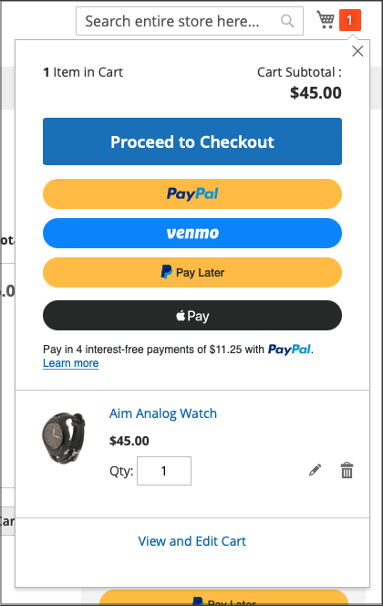

# Opzioni di pagamento

Con [!DNL Adobe Commerce] e [!DNL Magento Open Source] [!DNL Payment Services], sono disponibili più opzioni di pagamento.

Puoi configurare queste opzioni di pagamento in [Impostazioni home](payments-home.md) o [Configurazione archivio](configure-admin.md) (consigliato per le opzioni di pagamento legacy o per una configurazione multi-store).

Esistono comportamenti diversi per ogni metodo di pagamento a seconda della posizione in cui sei nel processo di pagamento:

* Pagina prodotto: la pagina di prodotto di un elemento
* Mini carrello: disponibile facendo clic sull&#39;icona del carrello quando un prodotto è stato aggiunto ai carrelli
* Carrello acquisti: disponibile facendo clic su _Visualizza e modifica carrello_ dal mini-carrello
* Vista Check-Out - Disponibile quando fate clic su _Procedi all&#39;estrazione_ da mini-carrello o carrello

>[!IMPORTANT]
>
>[!DNL Payment Services] l’onboarding deve essere completato prima che i pagamenti possano essere elaborati.

## Esperienza pagamenti standard e avanzati

[!DNL Payment Services] fornisce **Avanzate** (completamente supportato) e **Standard** Opzioni di pagamento e flussi di onboarding (Pagamento rapido), a seconda del paese in cui operi.

* **Avanzate** - Tutto disponibile [opzioni di pagamento](../payment-services/payments-options.md) sono disponibili per il [paesi pienamente supportati](../payment-services/overview.md#availability). Durante l’onboarding per abilitare i pagamenti live, seleziona la [Opzione di onboarding avanzato](../payment-services/production.md#advanced-onboarding).
* **Standard** - Un sottoinsieme di opzioni di pagamento (Express Checkout) (carte di credito e di debito PayPal) è disponibile per altri paesi supportati. [Campi carta di credito](#credit-card-fields) e [Apple Pay](#apple-pay-button) non sono disponibili per questa opzione di onboarding. Durante l’onboarding per abilitare i pagamenti live, seleziona la [Opzione di onboarding standard](../payment-services/production.md#standard-onboarding).

Consulta [Abilita [!DNL Payment Services] per la produzione](../payment-services/production.md#complete-merchant-onboarding) per informazioni sul completamento dell’onboarding avanzato e standard.

## [!UICONTROL Credit Card Fields]

[!UICONTROL Credit Card Fields] fornire un pagamento semplice e sicuro per i metodi di pagamento con carta di credito o con carta di debito. Quando un acquirente effettua il check-out utilizzando i campi della carta di credito, inserisce il proprio nome, l’indirizzo di fatturazione e le informazioni sulla carta di credito o di debito per effettuare l’ordine. Le informazioni sui clienti vengono utilizzate in modo sicuro durante la sessione di acquisto per guidarli all’interno del flusso di pagamento.

{width="500" zoomable="yes"}

Abilita [vaulting con carta di credito](#vaulting) per consentire ai tuoi negozi di archiviare (salvare) le informazioni sulla carta di credito per un pagamento rapido in un secondo momento.

Puoi configurare [!UICONTROL Credit Card Fields] nella configurazione dell&#39;archivio o [!DNL Payment Services] A casa. Consulta [Impostazioni](settings.md#credit-card-fields) per ulteriori informazioni.

È inoltre possibile modificare il layout, la larghezza, l&#39;altezza e lo stile esterno dei campi della carta di credito. Consulta [Documentazione di PayPal](https://developer.paypal.com/docs/checkout/advanced/customize/card-field-style/) per ulteriori informazioni.

## [!DNL Apple Pay] pulsante

I clienti possono utilizzare [[!DNL Apple Pay]](https://www.apple.com/apple-pay/), che utilizza le credenziali di pagamento con carta di credito e di debito memorizzate su un dispositivo iOS o macOS, per effettuare acquisti.

[!DNL Apple Pay] è disponibile solo nel browser Safari.

{width="500" zoomable="yes"}

Il [!DNL Apple Pay] è visibile dalla pagina del prodotto, dal mini-carrello, dal carrello e dalle viste di pagamento.

>[!NOTE]
>
> Da utilizzare [!DNL Apple Pay] per i negozi, completa [registrazione autonoma con [!DNL Apple Pay]](https://developer.paypal.com/docs/checkout/apm/apple-pay/#register-your-live-domain) (_Registra il dominio live_ solo sezione ) e [configuralo per i tuoi store in [!DNL Payment Services]](settings.md#payment-buttons).

Puoi configurare [!UICONTROL Apple Pay] nella configurazione del negozio o nella Home di Payment Services. Consulta [Impostazioni](settings.md#apple-pay) per ulteriori informazioni.

## [!DNL PayPal Payment Buttons]

[!DNL PayPal payment buttons], che utilizzano PayPal per completare un acquisto, memorizza l&#39;indirizzo di spedizione, gli indirizzi di fatturazione e i dettagli del pagamento del cliente per un uso successivo. Gli acquirenti possono utilizzare qualsiasi metodo di pagamento precedentemente memorizzato o offerto da PayPal.

{width="350" zoomable="yes"}

Puoi configurare [!UICONTROL PayPal payment buttons] nella configurazione dell&#39;archivio o [!DNL Payment Services] A casa.  Consulta [Impostazioni](settings.md#payment-buttons) per ulteriori informazioni.

Vedi PayPal [Documentazione sui metodi di pagamento](https://developer.paypal.com/docs/checkout/payment-methods/) per sapere in quali paesi è attualmente disponibile ogni metodo di pagamento.

### [!DNL PayPal] pulsante

I clienti possono effettuare il check-out con facilità e sicurezza utilizzando il pulsante PayPal.

Il [!DNL PayPal] è visibile dalla pagina del prodotto, dal mini-carrello, dal carrello e dalle viste di pagamento.

### [!DNL Venmo] pulsante

I clienti possono effettuare il check-out utilizzando [Venmo](https://venmo.com/) pulsante.

Il [!DNL Venmo] è visibile dalla pagina del prodotto, dal mini-carrello, dal carrello e dalle viste di pagamento.

### Pulsante di addebito o carta di credito PayPal

I clienti possono effettuare il check-out utilizzando il pulsante PayPal Debit o carta di credito.

Il pulsante PayPal Debit o carta di credito è visibile dalla pagina di pagamento.

Questa opzione può essere utilizzata per presentare un&#39;opzione di pagamento con carta di debito o di credito agli acquirenti con un pulsante ospitato da PayPal come alternativa all&#39;integrazione con carta di credito.

### [!DNL Pay Later] pulsante

Offri ai tuoi clienti pagamenti a breve termine senza interessi e altre opzioni di finanziamento in modo che possano acquistare subito e pagare in seguito con [!DNL Pay Later] pulsante.

Il [!DNL Pay Later] è visibile dalla pagina del prodotto, dal mini-carrello, dal carrello e dalle viste di pagamento.

Consulta le informazioni sulle offerte Paga più tardi in [PayPal&#39;s Pay Later offre la documentazione](https://developer.paypal.com/docs/checkout/pay-later/us/). Utilizza il **Paese** per selezionare un’area di interesse.

Consulta [Impostazioni](settings.md#payment-buttons) per scoprire come disabilitare/abilitare [!DNL Pay Later] messaggi.

## Utilizza solo i pulsanti di pagamento PayPal

Per attivare rapidamente la modalità di produzione, puoi configurare _solo_ Pulsanti di pagamento PayPal (Venmo, PayPal, ecc.)- invece di utilizzare anche l&#39;opzione di pagamento con carta di credito PayPal.

Questo consente di:

* Fornisci ai tuoi clienti varie opzioni di pagamento, tra cui i pulsanti di pagamento Venmo e PayPal, con la possibilità di disattivare i campi della carta ospitata PayPal e utilizzare un provider di carta di credito esistente.
* Utilizza il provider di carte di credito esistente per i pagamenti con carta di credito, utilizzando anche le altre opzioni di pagamento di PayPal.
* Utilizza i pulsanti di pagamento di PayPal in un&#39;area in cui PayPal non supporta le carte di credito come opzione di pagamento.

A **acquisire pagamenti con _solo_ Pulsanti di pagamento PayPal (_non_ l&#39;opzione di pagamento con carta di credito PayPal)**:

1. Assicurati che il tuo negozio sia [in modalità di produzione](settings.md#enable-payment-services).
1. [Configura i pulsanti di pagamento PayPal desiderati](settings.md#payment-buttons) in Impostazioni.
1. Turno _Disattivato_ il **[[!UICONTROL Show PayPal Credit and Debit card button]](settings.md#payment-buttons)** opzione in _[!UICONTROL Payment buttons]_sezione.

A **acquisire i pagamenti con il provider di carte di credito esistente _e_ Pulsanti di pagamento PayPal**:

1. Assicurati che il tuo negozio sia [in modalità di produzione](settings.md#enable-payment-services).
1. [Configura i pulsanti di pagamento PayPal desiderati](settings.md#payment-buttons).
1. Turno _Disattivato_ il **[[!UICONTROL PayPal Show Credit and Debit card button]](settings.md#payment-buttons)** opzione in _[!UICONTROL Payment buttons]_sezione.
1. Turno _Disattivato_ il **[[!UICONTROL Show on checkout page]](settings.md#credit-card-fields)** opzione in _[!UICONTROL Credit card fields]_e utilizza il tuo [account provider carta di credito esistente](https://experienceleague.adobe.com/docs/commerce-admin/stores-sales/payments/payments.html#payments).

## Ricalcolo ordine

Quando un cliente accede al flusso di pagamento dal mini-carrello, dal carrello o dalla pagina del prodotto, viene indirizzato a una pagina di revisione dell’ordine in cui può visualizzare l’indirizzo di spedizione selezionato in una finestra a comparsa PayPal. Dopo che il cliente ha selezionato il metodo di spedizione, l&#39;importo dell&#39;ordine viene ricalcolato in modo appropriato e il cliente può visualizzare le spese di spedizione e le imposte.

Quando un cliente accede al flusso di pagamento dalla pagina di pagamento, il sistema è già a conoscenza dell&#39;indirizzo di spedizione e dell&#39;importo calcolato finale e i totali sono rappresentati in modo appropriato.

Le esenzioni fiscali, le spese di spedizione e l&#39;IVA possono variare notevolmente da un&#39;ubicazione all&#39;altra. Dopo [!DNL Payment Services] riceve l&#39;indirizzo e la tariffa di spedizione, ricalcola rapidamente tutti i costi applicabili e li visualizza in modo appropriato durante le ultime fasi di pagamento.

## Vaulting con carta di credito

Gli acquirenti possono vagliare, o &quot;salvare&quot;, le informazioni sulla loro carta di credito per acquisti futuri a livello del sito web (qualsiasi negozio all&#39;interno dello stesso account del commerciante).

Consulta [Vaulting con carta di credito](vaulting.md) per ulteriori informazioni.

## Sicurezza

Consulta [Conformità PCI](security.md#pci-compliance) per ulteriori informazioni.
