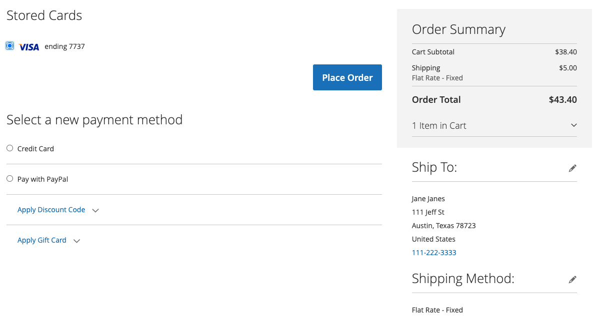

# Archiviazione carte di credito

Convertire clienti una tantum in acquirenti fedeli con il vaulting della carta di credito. Gli acquirenti possono salvare le credenziali della propria carta di credito durante il pagamento per utilizzarle in un acquisto successivo per lo stesso, o per un altro, negozio all&#39;interno dello stesso account commerciale.

Gli acquirenti utilizzano il token memorizzato per completare un checkout futuro con le informazioni sulla carta di credito salvate.

Inoltre possono facilmente cancellare le loro carte di credito evaulate da [Metodi di pagamento memorizzati](https://docs.magento.com/user-guide/customers/account-dashboard-stored-payment-methods.html) nel loro account personale.

## Abilita vaulting

È possibile abilitare l&#39;archiviazione della carta di credito per i negozi in Servizi di pagamento [Impostazioni](settings.md#card-vaulting).

## Sicurezza

Le informazioni minime sulla carta di credito sono condivise con l&#39;acquirente; vedono solo le ultime quattro cifre, la data di scadenza e il marchio della loro carta di credito vaulted. Le informazioni sulla carta di credito sono memorizzate con il provider di pagamento per soddisfare [PCI](security.md#PCI-compliance) norme di conformità.
