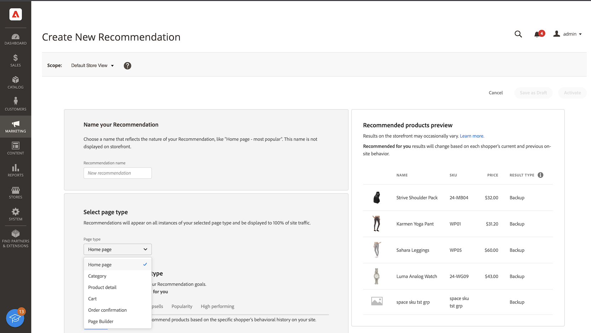

# Crea nuovo consiglio

Quando crei un consiglio, crei una _unità di consigli_ contenente il prodotto consigliato _elementi_.

_Unità consigli_

Quando attivi l&#39;unità di consigli, Adobe Commerce inizia a [raccogliere dati](workspace.md) per misurare impression, visualizzazioni, clic e così via. La tabella [!DNL Product Recommendations] visualizza le metriche per ogni unità di consigli per aiutarti a prendere decisioni aziendali informate.

1. Nella barra laterale _Amministratore_, vai a **Marketing** > _Promozioni_ > **Product Recommendations** per visualizzare l&#39;area di lavoro _Product Recommendations_.

1. Specifica la [visualizzazione archivio](https://experienceleague.adobe.com/docs/commerce-admin/start/setup/websites-stores-views.html#scope-settings) in cui desideri visualizzare i consigli.

   >[!NOTE]
   >
   > Le unità di consigli di Page Builder devono essere create nella vista store predefinita, ma possono essere utilizzate ovunque. Per ulteriori informazioni sulla creazione di consigli di prodotto con Page Builder, consulta [Aggiungi contenuto - Product Recommendations](https://experienceleague.adobe.com/docs/commerce-admin/page-builder/add-content/recommendations.html).

1. Fai clic su **Crea consiglio**.

1. Nella sezione _Denomina il consiglio_, inserisci un nome descrittivo per il riferimento interno, ad esempio `Home page most popular`.

1. Nella sezione _Seleziona tipo di pagina_, seleziona la pagina in cui desideri visualizzare il consiglio tra le seguenti opzioni:

   >[!NOTE]
   >
   > I Recommendations dei prodotti non sono supportati nella pagina del carrello quando lo store è configurato per [visualizzare la pagina del carrello subito dopo l&#39;aggiunta di un prodotto al carrello](https://experienceleague.adobe.com/docs/commerce-admin/stores-sales/point-of-purchase/cart/cart-configuration.html#redirect-to-cart).

   * Home page
   * Categoria
   * Dettagli prodotto
   * Carrello
   * Conferma
   * [Page Builder](https://experienceleague.adobe.com/docs/commerce-admin/page-builder/add-content/recommendations.html)

   Puoi creare fino a cinque unità di consigli attive per ogni tipo di pagina e fino a 25 per Page Builder. Il tipo di pagina è disattivato Al raggiungimento del limite.

   
   _Nome consiglio e posizionamento pagina_

1. Nella sezione _Seleziona tipo di consiglio_, specifica il [tipo di consiglio](type.md) che desideri visualizzare nella pagina selezionata. Per alcune pagine, il [posizionamento](placement.md) dei consigli è limitato a determinati tipi.

1. Nella sezione _Etichetta di visualizzazione vetrina_, immetti la [etichetta](placement.md#recommendation-labels) visibile agli acquirenti, ad esempio &quot;Più venduti&quot;.

1. Nella sezione _Scegli il numero di prodotti_, utilizza il cursore per specificare il numero di prodotti da visualizzare nell&#39;unità di consigli.

   Il valore predefinito è `5`, con un massimo di `20`.

1. Nella sezione _Seleziona posizionamento_, specifica il percorso in cui l&#39;unità di consigli deve essere visualizzata nella pagina.

   * Nella parte inferiore del contenuto principale
   * Nella parte superiore del contenuto principale

1. (Facoltativo) Per modificare l&#39;ordine dei consigli, selezionare e spostare le righe nella tabella _Scegli posizione_.

   Nella sezione _Scegli posizione_ vengono visualizzati tutti i consigli (se presenti) creati per il tipo di pagina selezionato.

   
   _Ordine consigli a pagina_

1. (Facoltativo) Nella sezione _Filtri_, [applica filtri](filters.md) per controllare quali prodotti vengono visualizzati nell&#39;unità di consigli.

   
   _Filtri di prodotto per consigli_

1. Al termine, fare clic su una delle seguenti opzioni:

   * **Salva come bozza** per modificare l&#39;unità di consigli in un secondo momento. Non è possibile modificare il tipo di pagina o il tipo di consiglio per un&#39;unità di consigli in stato bozza.

   * **Attiva** per abilitare l&#39;unità di consigli nella vetrina.

## Indicatori di preparazione

Alcuni tipi di consigli utilizzano i dati comportamentali dei tuoi acquirenti per [addestrare modelli di apprendimento automatico](behavioral-data.md) per creare consigli personalizzati.

Richiede solo dati di catalogo. Non sono necessari dati comportamentali per:

* _Articoli più simili_
* _Visualizzato di recente_
* _Somiglianza Visiva_

In base agli ultimi sei mesi di dati comportamentali della vetrina:

* _Ha visualizzato questo, ha visualizzato quello_
* _Ha visualizzato questo/a, ha acquistato quello/a_
* _Ha acquistato questo/a, l&#39;ha acquistato_
* _Consigliato per te_

I tipi di consigli basati sulla popolarità utilizzano gli ultimi sette giorni di dati comportamentali della vetrina:

* Articoli più visualizzati
* Più acquistati
* Aggiunto al carrello
* Di tendenza

I valori dell’indicatore di preparazione dovrebbero variare a causa di fattori quali le dimensioni complessive del catalogo, il volume di eventi di interazione del prodotto (visualizzazioni, aggiunte al carrello, acquisti) e la percentuale di SKU che registrano tali eventi entro una determinata finestra temporale, come indicato sopra. Ad esempio, durante il traffico di picco durante le festività, gli indicatori di prontezza potrebbero mostrare valori più elevati rispetto ai tempi del volume normale.

Per aiutarti a visualizzare l&#39;avanzamento della formazione di ciascun tipo di consiglio, la sezione _Seleziona tipo di consiglio_ mostra una misura di preparazione per ciascun tipo. Questi indicatori di prontezza sono calcolati sulla base di due fattori:

* Dimensione sufficiente del set di risultati: nella maggior parte degli scenari sono stati restituiti risultati sufficienti per evitare di utilizzare [consigli di backup](behavioral-data.md#backuprecs)?

* Sufficiente varietà di set di risultati: i prodotti restituiti rappresentano una varietà di prodotti del catalogo? L’obiettivo con questo fattore è evitare di avere una minoranza di prodotti come unici articoli consigliati in tutto il sito.

In base ai fattori di cui sopra, viene calcolato e visualizzato un valore di fattibilità. Un tipo di consiglio è considerato pronto per la distribuzione quando il suo valore di fattibilità è pari o superiore al 75%. Un tipo di consiglio è considerato parzialmente pronto quando la sua prontezza è almeno del 50%. Un tipo di consiglio è considerato non pronto per la distribuzione quando il suo valore di fattibilità è inferiore al 50%. Si tratta di linee guida generali, ma ogni singolo caso può variare in base alla natura dei dati raccolti come descritto sopra.

_Tipo di consiglio_

>[!NOTE]
>
>Gli indicatori non possono mai raggiungere il 100%.

## Anteprima Recommendations {#preview}

Il pannello _Anteprima prodotti consigliati_ è sempre disponibile con una selezione di esempi di prodotti che potrebbero comparire nell&#39;unità consigli quando viene distribuita nella vetrina.

Per testare un consiglio quando si lavora in un ambiente non di produzione, è possibile recuperare i dati dei consigli da una [origine diversa](settings.md). Questo consente ai commercianti di sperimentare le regole e visualizzare in anteprima i consigli prima di distribuirli in produzione.

| Campo | Descrizione |
|---|---|
| Nome | Il nome del prodotto. |
| SKU | Unità di stoccaggio assegnata al prodotto |
| Prezzo | Il prezzo del prodotto. |
| Tipo di risultato | Principale: indica che sono stati raccolti dati di formazione sufficienti per visualizzare un consiglio. Backup: indica che i dati di formazione raccolti non sono sufficienti, pertanto per riempire lo slot viene utilizzato un consiglio di backup. Vai a [Dati comportamentali](behavioral-data.md) per ulteriori informazioni sui modelli di apprendimento automatico e sui consigli di backup. |

Quando crei la tua unità di consigli, prova con il tipo di pagina, il tipo di consiglio e i filtri per ottenere un feedback in tempo reale e immediato sui prodotti che verranno inclusi. Quando inizi a capire quali prodotti vengono visualizzati, puoi configurare l’unità di consigli in base alle tue esigenze aziendali.

Adobe Commerce [filtra](filters.md) consigli per evitare di visualizzare prodotti duplicati quando più unità di consigli vengono distribuite in una singola pagina. Di conseguenza, i prodotti visualizzati nel pannello di anteprima potrebbero essere diversi da quelli visualizzati nella vetrina.

>[!NOTE]
>
> Impossibile visualizzare in anteprima il tipo di consiglio `Recently viewed` perché i dati non sono disponibili nell&#39;amministratore.
